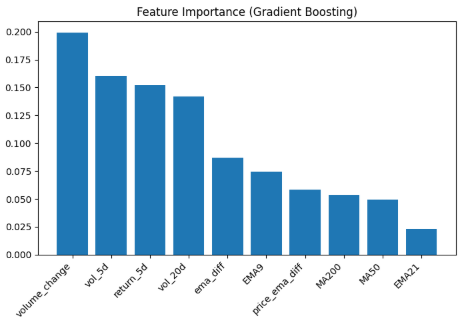
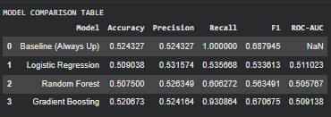
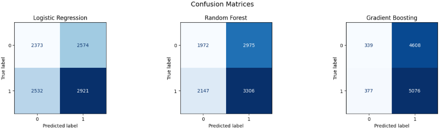
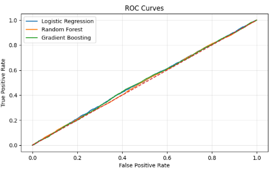
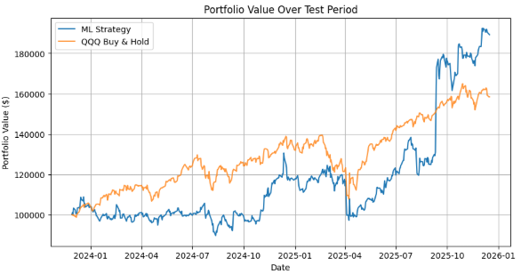
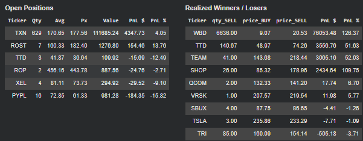
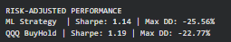

# Data-Bootcamp-Final
Dennis, Eilon, Ivan
# Machine Learning Based Trading Strategy

## 1. Introduction

This project builds a machine learning model to predict next day stock price direction and use those predictions inside a trading strategy. The goal is not just to see how accurate the model is, but to see how those predictions affect portfolio performance over time. The problem is framed as next day directional classification instead of price level forecasting, since short term prices are noisy and direction is easier to turn into buy and sell decisions.

The project is a direct extension of the midterm. Several components from the midterm were kept, including the data ingestion pipeline, technical indicator construction, and the `PortfolioTracker` class. These parts already worked correctly and were not the focus of the final. Keeping them allowed the project to focus on changing how signals are generated rather than rebuilding portfolio mechanics or data handling from scratch.

The main change from the midterm is the move from rule based signals to model based probabilities. Instead of fixed indicator rules, the strategy uses predicted probabilities to decide when to trade and how much capital to allocate. This allows position sizes to scale with confidence rather than treating all signals the same. Even though the model’s predictive accuracy is modest, the results show that these probability based signals can still lead to meaningful differences in portfolio outcomes compared to a simple buy and hold strategy.

---

## 2. Data Description

The dataset consists of daily price and volume data for Nasdaq 100 stocks. Tickers are loaded dynamically using the 'load_QQQ_tickers()' function, which scrapes the current constituent list from Wikipedia. Historical price data is retrieved through the Yahoo Finance API using 'fetch_data()'.

For each ticker, approximately two years of daily data are collected using a rolling window defined in 'get_date_range(days=780)'. Each stock is processed independently to avoid cross asset information leakage. The core fields used are Open, High, Low, Close, and Volume.

Basic data cleaning is applied before feature construction, including removing missing values, flattening multi index columns when necessary, and standardizing datetime indexing. The focus on large cap, highly liquid stocks helps reduce noise related to illiquidity and makes benchmarking against a market index more straightforward.

---

## 3. Feature Engineering and Dataset Construction

Feature engineering is designed to capture short term momentum, trend, and volatility information using standard technical indicators. Indicator construction is handled in two main functions: 'indicators(df)' and 'build_features(df)'. These functions extend the indicator logic from the midterm while reshaping it to support supervised learning instead of rule based signals.

The 'indicators()' function computes trend based features, including exponential moving averages with spans of 9 and 21 days, as well as simple moving averages over 50 and 200 days. These features are used to capture short term versus medium term trend behavior. The 'build_features()' function then adds return and volatility based features, including one day and five day returns, rolling return volatility over 5 and 20 day windows, price distance from key moving averages, and daily percentage changes in trading volume.
All features are computed strictly using historical price information. The prediction target is defined inside 'process_one_ticker()' as a binary variable indicating whether the next day return is positive. This target is created using a forward shifted return via '.shift(-1)', which ensures that no future information is used during feature construction and avoids look ahead bias.

Feature engineering is performed independently for each ticker inside 'process_one_ticker()'. The resulting per ticker datasets are then concatenated into a single modeling dataset using 'pd.concat(dfs)'. After concatenation, the dataset is sorted by ticker and date to preserve temporal ordering. Rows with incomplete feature values are removed only after all features and targets are constructed. An explicit assertion is used to confirm that dates are monotonically increasing within each ticker, enforcing a valid time series structure.

This final dataset structure supports both cross sectional learning across stocks and time aware evaluation during model training.

### Feature Importance

---

## 4. Models and Methods

Three classical machine learning models are evaluated in this project: Logistic Regression, Random Forest, and Gradient Boosting. These models were chosen to provide a mix of linear and nonlinear approaches while remaining interpretable and stable for a relatively noisy financial prediction task. In addition to these models, an always up baseline is included to account for the natural upward drift of equity markets.

Before training, the dataset is split using a time aware train test split. Rather than randomly sampling observations, the split is performed by index, with the first 80 percent of observations used for training and the remaining 20 percent reserved for testing. This approach better reflects how the model would be used in practice and avoids leaking future information into the training set.

Feature scaling is applied using 'StandardScaler'. The scaler is fit on the training data and then applied to the test data to ensure consistent transformations. Scaling is required for models such as Logistic Regression that are sensitive to feature magnitudes, and it is applied uniformly across all models for consistency.

Model training and evaluation are handled through the 'evaluate_model()' function. This function fits each model on the training set, generates predictions on the test set, and computes multiple performance metrics including accuracy, precision, recall, F1 score, and ROC AUC when probability outputs are available. These metrics are stored in a summary table for direct comparison across models.

Visual diagnostics are used to supplement numeric metrics. Confusion matrices are generated side by side to show classification behavior, ROC curves are plotted on a single chart to compare probability based performance, and feature importance is extracted for tree based models. The final model is selected automatically by ranking non baseline models on recall, F1 score, and ROC AUC in that order. The always up baseline is excluded from model selection and used only as a reference point.

### Model Comparison Table

### Confusion Matrices

### ROC Curves

---

## 5. Trading Strategy and Simulation

The trading strategy converts model outputs into probabilistic signals rather than fixed buy and sell rules. Instead of using predicted class labels, the strategy relies on predicted probabilities generated by the selected model using predict_proba. These probabilities are interpreted as confidence levels and are used both to determine whether a trade is placed and how large the position should be.

Model selection is performed automatically before trading begins. Non baseline models are ranked based on recall, F1 score, and ROC AUC, and the top ranked model is selected for deployment. In this project, Gradient Boosting is selected. Trading signals are generated by applying a fixed probability threshold defined as FINAL_THRESHOLD = 0.55. A buy signal is generated when the predicted probability of an upward move exceeds this threshold, while a sell signal is generated when the probability falls below 1 - FINAL_THRESHOLD. Observations that fall between these bounds result in no action.

Portfolio execution is handled by the run_strategy_confidence_weighted() function, which simulates a single evolving portfolio over time. Position sizing is confidence weighted, meaning capital is allocated across buy signals in proportion to their predicted probabilities. A maximum portfolio exposure constraint of max_exposure = 0.6 is enforced to limit risk concentration and prevent over allocation during high signal density periods. Positions are marked to market daily using observed closing prices, and both cash and holdings are tracked explicitly through the PortfolioTracker class.

An earlier version of this project attempted to execute trades through the Tradier paper trading API, which was implemented during the midterm. During testing, Tradier imposed execution constraints that capped order sizes and forced trades into fixed dollar increments. These constraints prevented realistic confidence weighted position sizing and caused portfolio behavior to diverge from model intent. For the final project, a fully controlled in notebook simulation is used instead, ensuring that execution logic aligns directly with model outputs and allowing for a cleaner evaluation of strategy behavior.

### Strategy Performance

---

## 6. Results and Interpretation

The selected model for deployment is Gradient Boosting, based on the automated ranking criteria applied to recall, F1 score, and ROC AUC. As expected for short horizon equity prediction, classification performance is modest across all evaluated models. Accuracy and precision are close to baseline levels, and no model consistently achieves strong standalone predictive metrics. However, these metrics do not fully capture how the predictions behave once embedded in a trading strategy.

Strategy performance is evaluated by simulating portfolio value over the test period and comparing it directly to a QQQ buy and hold benchmark. Portfolio value over time is plotted using the equity curve generated by 'run_strategy_confidence_weighted()', alongside the cumulative return of QQQ over the same dates. This comparison shows that the strategy is able to outperform buy and hold over the test window, with faster recovery following drawdowns and stronger upside during periods where high confidence signals are more concentrated.

Portfolio state at the end of the simulation is summarized using two tables generated directly from the simulation output. Open positions are displayed in a table showing quantity, average entry price, current price, and unrealized profit and loss. Realized trades are summarized separately using the trade history stored in 'portfolio.history', allowing closed winners and losers to be evaluated independently from open exposure.

Risk adjusted performance is evaluated using daily returns derived from the equity curve. Sharpe ratios are computed for both the strategy and the benchmark, along with maximum drawdown calculated using cumulative peak equity. Results show similar Sharpe ratios between the two approaches, while the strategy experiences larger drawdowns due to higher concentration during high confidence periods. These outcomes highlight the trade off between return maximization and risk control when using confidence weighted allocation.

### Open Positions & Realized Winners and Losers

### Risk Adjusted Performance

---

## 7. Conclusion and Next Steps

This project shows how machine learning predictions can be integrated into a systematic trading framework rather than evaluated in isolation. Even with modest predictive accuracy, probability based signals can still produce meaningful differences in portfolio behavior when combined with disciplined execution and risk constraints. The confidence weighted allocation approach allows the strategy to express varying levels of conviction instead of relying on uniform position sizes.

There are several limitations to the current setup. The simulation assumes ideal execution and does not account for transaction costs, slippage, or market impact, all of which would reduce realized performance in practice. The strategy also relies on a fixed probability threshold and static exposure limits, which may not be optimal across different market regimes.

Future extensions could include adding regime aware features, experimenting with dynamic threshold selection, or incorporating risk based position sizing rules. Another natural next step would be reconnecting the strategy to a brokerage API once execution constraints can be handled in a way that preserves confidence weighted allocation. Overall, the project highlights the importance of evaluating predictive models through their portfolio level impact rather than relying solely on classification metrics.

